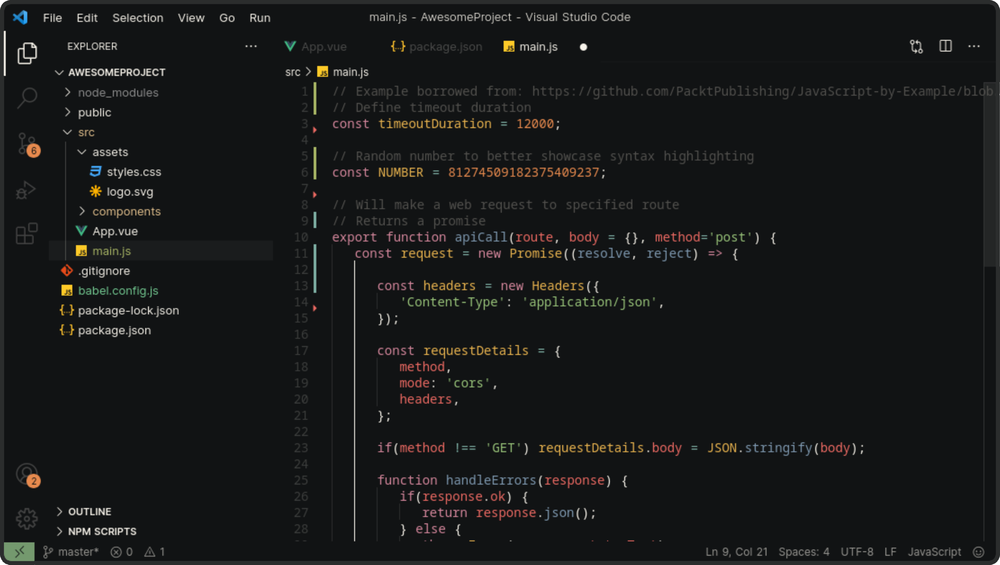

<h1 align="center">
  <br>
  <a href="https://marketplace.visualstudio.com/items?itemName=u1145h.u1145h-heme-ark">
    
  </a>
  <br>
  Noir Essence
  <br>
</h1>


## 👋 About
A minimalist [Gruvbox](https://github.com/morhetz/gruvbox)-inspired theme with a darker background and clean, borderless design. Green accents and vibrant syntax highlighting offer a focused, consistent look. Perfect for those who enjoy a simple yet striking dark theme.


## 💾 Installation

Launch _Quick Open_

- Linux</a> `Ctrl+P`
- macOS</a> `⌘+P`
- Windows</a> `Ctrl+P`

Paste the following command and press `Enter`:
```
ext install u1145h.u1145h-heme-ark
```


## 🎨 Variants

- Dark


- Dark Border


- Light


## 🗒️ Release Notes
See [Changelog](CHANGELOG.md).


### ☑️ Todo
- [x] Add Light Mode
- [X] Add Other Varients